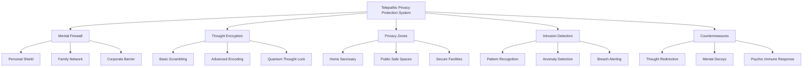

# Imagine a World with Telepathy Using the Design System Method

This Telepathic Privacy Protection System can be decomposed into five main components:

1. Mental Firewall: A protective barrier that prevents unauthorized telepathic access.
   - Personal Shield: Individual-level protection
   - Family Network: Shared protection for close family members
   - Corporate Barrier: Large-scale protection for organizations

2. Thought Encryption: Methods to obscure or encode thoughts.
   - Basic Scrambling: Simple technique to make thoughts harder to read
   - Advanced Encoding: Complex algorithms for thought protection
   - Quantum Thought Lock: Highest level of security using quantum principles

3. Privacy Zones: Physical or virtual spaces where telepathy is blocked or limited.
   - Home Sanctuary: Telepathy-free home environments
   - Public Safe Spaces: Designated areas in public for mental privacy
   - Secure Facilities: High-security locations with complete telepathic isolation

4. Intrusion Detection: Systems to identify unauthorized telepathic access attempts.
   - Pattern Recognition: Identifies known telepathic intrusion techniques
   - Anomaly Detection: Spots unusual mental activity that could indicate an intrusion
   - Breach Alerting: Notifies the individual of potential privacy violations

5. Countermeasures: Active defenses against telepathic intrusions.
   - Thought Redirection: Guides intruders away from sensitive information
   - Mental Decoys: Creates false thoughts to mislead unauthorized readers
   - Psychic Immune Response: Automatic mental defenses against intrusions
