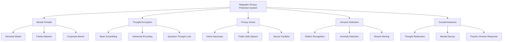

# Imagine a World with Telepathy Using the Design System Method

Certainly! Let's explore the privacy implications of telepathy using both the Lists and Templates method and the Design Systems method.

First, let's create some list and template content to help a writer think about privacy compromises in a telepathic world:

# Privacy Concerns in a Telepathic World

## Types of Telepathic Privacy Invasions
1. Unintentional thought broadcasting
2. Deliberate mind-reading
3. Emotional leakage
4. Memory infiltration
5. Dream intrusion
6. Subconscious data mining
7. Collective thought manipulation

## Vulnerable Populations
- Children and teenagers
- Elderly with declining mental faculties
- Individuals with mental health conditions
- Public figures and celebrities
- Government officials and diplomats
- Corporate executives and employees with sensitive information
- Victims of trauma or abuse

## Potential Consequences of Privacy Breaches
- Identity theft
- Emotional distress
- Blackmail and extortion
- Corporate espionage
- National security threats
- Manipulation of financial markets
- Breakdown of personal relationships

## Template: Telepathic Privacy Violation Scenario

1. Violator:
   - Identity:
   - Motivation:
   - Telepathic ability level:

2. Victim:
   - Identity:
   - Vulnerability:
   - Type of information at risk:

3. Method of Intrusion:
   - Telepathic technique used:
   - Duration and frequency:
   - Any technology assisted?

4. Information Accessed:
   - Type of thoughts/memories:
   - Sensitivity level:
   - Potential for misuse:

5. Consequences:
   - Immediate effects on the victim:
   - Long-term implications:
   - Wider societal impact:

6. Legal/Ethical Considerations:
   - Applicable laws:
   - Ethical dilemmas:
   - Potential defenses or justifications:

7. Prevention/Mitigation:
   - Existing safeguards:
   - Proposed solutions:
   - Challenges in implementation:

Now, let's create a complex structure related to privacy threats in a telepathic world that can be decomposed using the Design Systems method:

This Telepathic Privacy Protection System can be decomposed into five main components:

1. Mental Firewall: A protective barrier that prevents unauthorized telepathic access.
   - Personal Shield: Individual-level protection
   - Family Network: Shared protection for close family members
   - Corporate Barrier: Large-scale protection for organizations

2. Thought Encryption: Methods to obscure or encode thoughts.
   - Basic Scrambling: Simple technique to make thoughts harder to read
   - Advanced Encoding: Complex algorithms for thought protection
   - Quantum Thought Lock: Highest level of security using quantum principles

3. Privacy Zones: Physical or virtual spaces where telepathy is blocked or limited.
   - Home Sanctuary: Telepathy-free home environments
   - Public Safe Spaces: Designated areas in public for mental privacy
   - Secure Facilities: High-security locations with complete telepathic isolation

4. Intrusion Detection: Systems to identify unauthorized telepathic access attempts.
   - Pattern Recognition: Identifies known telepathic intrusion techniques
   - Anomaly Detection: Spots unusual mental activity that could indicate an intrusion
   - Breach Alerting: Notifies the individual of potential privacy violations

5. Countermeasures: Active defenses against telepathic intrusions.
   - Thought Redirection: Guides intruders away from sensitive information
   - Mental Decoys: Creates false thoughts to mislead unauthorized readers
   - Psychic Immune Response: Automatic mental defenses against intrusions
